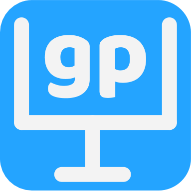

# GoalPost

 
# Project Synopsis
GoalPost is an app that incentivizes users to help reach their goals. For example, if a group of friends wants to go to the gym 3 times a week for the rest of the quarter, they would enter that into the app, and if anybody gets lazy, that person would get charged a couple dollars which goes to a common pool. At the end of the goal period, the pool can be split between everybody for a nice dinner or donated to charity, incentivizing individuals to stick to their original goal posts through reminders and friendly competition.
[View design specifications here](DesignSpec.md)
  
# Team Members
Member | Photo
--- | ---
Jesus Cervantes | 
Davy Ragland | 
Cam Thouati | 
Cherry Zou | 

# Team Skills
Member | Skills | Personal Traits | Desired Growth | Weaknesses
--- | --- | --- | --- | ---
Jesus Cervantes | AI/ML, Backend, Google Cloud, Python, Algorithms, C++ | Loud, energetic, 5'8" | Iterated development, larger system architecture | Software, shiny objects, Front end development 
Davy Ragland | Systems Engineering, Software Architecture, Product lifecycle, Aesthetic, Python, C++, Web, LaTeX, Computer Vision, Data parsing | Nice cheekbones, dislikes authority, 6'0" | Human Centered Design, Project Management, Interface Design, Marketing | lack of foresight, Math, ML, AI, spelling
Cam Thouati de Tazoult | C++, Java, Blockchain, RDBMS, React | short | backend, mobile app development, vertical | ML, high shelves 
Cherry Zou | AI/ML, Web, Back-end, Needfinding | Organized, cooperative, motivated | System design, Front-end | Mobile dev, impatient

# Team Communication
* Facebook Messenger
* @stanford Email
    * <cerjesus@stanford.edu>
    * <dragland@stanford.edu>
    * <cameron8@stanford.edu>
    * <cherryz@stanford.edu>
